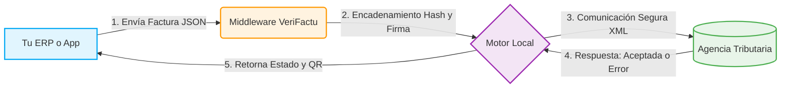

<div align="center">
  
  
  
  <br/><br/>
  
  <h1>🚀 Documentación del Middleware VeriFactu (B2B)</h1>
  <p><b>El puente definitivo entre tu ERP y la Agencia Tributaria (VeriFactu)</b></p>
  
  <br />
  <h3>🌐 Visita nuestra web oficial para más información sobre el Middleware, planes y soporte:</h3>
  <h2>👉 <a href="https://systemsfgh.com/">https://systemsfgh.com/</a> 👈</h2>
  <br />
</div>

> [!IMPORTANT]
> **📢 ESTADO DEL PRODUCTO: Disponible las versiones para Windows y Linux (Mirar realease v1.0.2)**
> El Middleware VeriFactu ya ha finalizando su fase de pruebas y **está disponible para descargar e instalar** en tu propia infraestructura. 
> Una vez descargado puede ser testeado sin necesidad de registro, pero si lo ves viable para su uso puede obtenerse una licencia completamente gratuita para **18 meses** desde su activación, tres emisores (NIF's con capacidad de emitir facturas), y un numero ilimitado de operaciones tras **Crear una cuenta con tu email en nuestra web, sin necesidad de aportar más datos.** y dispondrás de forma inmediata de la licencia con la clave de activación

Bienvenido al repositorio oficial de documentación de la **API VeriFactu**. Este repositorio contiene las guías técnicas, ejemplos de integración y la arquitectura de nuestro Middleware diseñado para facilitar a otras empresas el cumplimiento normativo exigido por el entorno VeriFactu de la Agencia Tributaria.

---

## 📌 ¿Qué es SystemsFGH Middleware VeriFactu? (Motor On-Premise)

Para cumplir con el **Real Decreto 1007/2023** (sistema VERI*FACTU), los desarrolladores de software de facturación y Puntos de Venta (TPV) deben implementar complejos requisitos técnicos: firma electrónica, cálculo encadenado de Hashes SHA-256, generación de códigos QR y comunicación XML inalterable con la AEAT.

Nuestro middleware es un **Motor Autónomo Instalable (On-Premise)** diseñado para hacer el trabajo sucio por ti. Actúa como una caja negra (proxy local inteligente): tu ERP le lanza un JSON genérico desde localhost, y nuestro motor se encarga de todo el proceso criptográfico y de comunicaciones, devolviéndote el estado y la URL del código QR lista para imprimir.

## ⚡ La Ventaja Local frente a APIs SaaS en la Nube

1. **Privacidad Extrema y RGPD:** A diferencia de las "APIs en la Nube", donde el ERP envía toda la facturación de la empresa a servidores de terceros, **nuestro motor se ejecuta localmente**. Los datos de tus clientes nunca salen de su ordenador, viajando desencriptados directamente a Hacienda.
2. **Custodia del Certificado FNMT:** El certificado de firma electrónica pertenece al cliente y reside de forma segura en su propia máquina.
3. **Resiliencia (Base de datos Firebird 5.0):** Al integrar Firebird de forma nativa, tu ERP nunca se quedará colgado si Hacienda no responde. Nuestro sistema encola las facturas asíncronamente en disco y las procesa en segundo plano de manera autónoma.

## 💻 Compatibilidad Universal (Cualquier Lenguaje ERP)

A diferencia de librerías cerradas o proyectos específicos (`.dll`, `NuGet`), nuestra API Verifactu se despliega como un Microservicio HTTP agnóstico en el equipo local. Esto lo hace **100% compatible con cualquier lenguaje o software clásico**:

- Delphi, C++Builder y Rad Studio.
- PHP, Laravel, Symfony.
- Python, Django, Flask, FastAPI.
- Java (Spring), C#, VB.NET, FoxPro.
- Node.js, Go, Rust.
- Velneo, FileMaker.

Si tu ERP puede enviar una petición `POST` mediante HTTP, ya has solucionado VeriFactu de una vez por todas.

---

## ⚖️ Licencia y Uso (¡Importante!)

> [!TIP]
> **🎁 ¡ QUEREMOS QUE PRUEBES NUESTRA API !**
> Para facilitar la adopción y las pruebas en entornos productivos, **durante los primeros 18 meses tras la instalación, no se activarán LOS MECANISMOS DE RENOVACIÓN**. Podrás utilizar y validar el Middleware sin restricciones comerciales durante este extenso periodo de gracia. Las licencias adquiridas están pensadas para una viabilidad a muy largo plazo.
> 
> Esta versión del software se ofrece con un periodo garantizado de 18 meses de uso sin necesidad de adquirir ni validar ningún tipo de licencia adicional. Durante este tiempo el usuario podrá instalar y utilizar la aplicación con total normalidad.

Transcurrido dicho periodo, es posible que el proyecto evolucione hacia un modelo de licencias comerciales acorde con las condiciones habituales del mercado, con el objetivo de sostener la infraestructura técnica, el mantenimiento del software y los servicios asociados.

Como principio fundamental del proyecto, se mantiene una garantía de continuidad tecnológica: el uso actual de la aplicación no debe generar dependencia ni riesgo para quienes decidan adoptarla.

En este sentido, y con el objetivo de reforzar la confianza de los usuarios a largo plazo, el proyecto contempla que, como alternativa a un modelo de explotación comercial, **el software pueda publicarse bajo licencia abierta MIT**, lo que aseguraría la plena libertad de uso, estudio y evolución de la aplicación por parte de la comunidad.

Nuestro propósito es ofrecer una herramienta útil, estable y confiable, cuya adopción hoy no suponga ningún riesgo de dependencia tecnológica ni de condiciones futuras imprevisibles.

---

## 🏗️ Diagrama de Funcionamiento

El Middleware actúa como una caja negra que recibe tus facturas en formato genérico JSON y se encarga de firmarlas, estructurarlas y enviarlas a Hacienda, devolviéndote el estado íntegro y la URL web de cotejo.



---

## 📚 Estructura de la Documentación

Toda la documentación está estructurada en la carpeta `docs/`:

1.  **[Visión General del Middleware](docs/01_vision_general.md)** - Conceptos básicos y propósito del sistema.
2.  **[Arquitectura de Componentes](docs/02_arquitectura_de_componentes.md)** - Diagrama general del Frontend, Backend y BD.
3.  **[Conceptos y Flujo de Trabajo (Workflows)](docs/03_conceptos_flujo_de_trabajo.md)** - Cómo funciona la ingesta de facturas y los estados.
4.  **[El Entorno de Simulación](docs/04_entorno_simulacion.md)** - Entorno seguro para pruebas sin enviar a la AEAT real.
5.  **[Integración de la API (REST)](docs/05_integracion_api.md)** - Referencia técnica de los _endpoints_ (Ingesta, Ack,...).
6.  **[Diccionario de Datos (API y BD)](docs/06_diccionario_datos.md)** - Definición del modelo JSON de peticiones y respuestas.
7.  **[Rutas y Estructura de Proyecto](docs/07_rutas_y_estructura.md)** - Organización interna del desarrollo.
8.  **[Monitorización y Registro (Logging)](docs/08_monitorizacion_y_logs.md)** - Información operativa del sistema.

---

## 🛠️ Guías de Integración por Lenguaje (SDKs)

En la carpeta `docs/sdk_integration_guides/` encontrarás guías listas para ser utilizadas en tu entorno de desarrollo. Ejemplos de conexión para:

*    [**Ver Guía de Integración Node.js en el navegador**](http://htmlpreview.github.io/?https://github.com/SystemsFGH/API-Verifactu-SystemsFGH/blob/main/docs/sdk_integration_guides/NODEJS_INTEGRATION_GUIDE.html)
*    [**Ver Guía de Integración Python en el navegador**](http://htmlpreview.github.io/?https://github.com/SystemsFGH/API-Verifactu-SystemsFGH/blob/main/docs/sdk_integration_guides/PYTHON_INTEGRATION_GUIDE.html)
*    [**Ver Guía de Integración C# en el navegador**](http://htmlpreview.github.io/?https://github.com/SystemsFGH/API-Verifactu-SystemsFGH/blob/main/docs/sdk_integration_guides/CSHARP_INTEGRATION_GUIDE.html)
*    [**Ver Guía de Integración PHP en el navegador**](http://htmlpreview.github.io/?https://github.com/SystemsFGH/API-Verifactu-SystemsFGH/blob/main/docs/sdk_integration_guides/PHP_INTEGRATION_GUIDE.html)
*    [**Ver Guía Delphi 7**](http://htmlpreview.github.io/?https://github.com/SystemsFGH/API-Verifactu-SystemsFGH/blob/main/docs/sdk_integration_guides/DELPHI7_INTEGRATION_GUIDE.html) • [**Ver Guía Delphi 10+**](http://htmlpreview.github.io/?https://github.com/SystemsFGH/API-Verifactu-SystemsFGH/blob/main/docs/sdk_integration_guides/DELPHI10_INTEGRATION_GUIDE.html)

## 🚀 Empezar

Si eres nuevo en la plataforma, te recomendamos leer primero la **[Visión General](docs/01_vision_general.md)** y posteriormente revisar la guía de integración del lenguaje de programación que utilices en tu empresa.

# VeriFactu Middleware AEAT - Windows y Linux Release v1.0.2

Esta actualización trae la primera arquitectura de instalación comercial de VeriFactu para entornos Linux. Hemos rediseñado por completo el ecosistema para ofrecer una experiencia empresarial impecable, automática y segura. 

## ✨ Novedades y Beneficios Principales instalador Linux

- 🚀 **Instalación Inteligente:** Olvídate de configuraciones manuales complejas. El nuevo asistente configura el ecosistema completo (servicios, bases de datos y permisos de red) de forma completamente autónoma.
- 🛡️ **Actualizaciones Seguras (Sin Pérdida de Datos):** Instalar una nueva versión del software reconoce automáticamente si tu empresa ya es cliente. Tus bases de datos, facturas, configuraciones y usuarios se blindan y preservan de forma garantizada durante la actualización.
- ⚙️ **Motor de Base de Datos Embebido:** Incluye internamente nuestro motor *Firebird 5.x* pre-configurado de alto rendimiento. No requiere que el equipo informático instale ni mantenga servidores SQL complejos de terceros.
- 🔄 **Alta Disponibilidad Automática:** VeriFactu se integra directamente en el núcleo del servidor. La API y el procesador de facturas arrancan solos, de forma silenciosa e invisible en segundo plano, garantizando su disponibilidad cada vez que se enciende la máquina.
- 🧹 **Gestor de Desinstalación Incorporado:** Incluye una herramienta oficial para retirar el componente legal de forma segura, permitiendo a la empresa elegir si desea realizar un borrado total o únicamente desinstalar el motor conservando el registro histórico de facturas de forma segura en disco.

## 🐧 Compatibilidad Soportada en Linux

El software está diseñado para operar bajo filosofía "Plug & Play" con máxima compatibilidad cruzada en arquitecturas modernas y servidores VPS comerciales.

**Soporte Oficial (Recomendado):**
- Ubuntu 24.04 LTS (Noble Numbat)
- Ubuntu 22.04 LTS (Jammy Jellyfish)

**Soporte Extendido:**
- Debian 12 (Bookworm) y distribuciones empresariales modernas basadas en Debian. *(El instalador resolverá dependencias de compilación en tiempo real de forma dinámica vía internet, por lo que requiere conexión a red durante el proceso).*

> **Aviso de Despliegue:** Para permitir que VeriFactu registre e incruste sus procesos automáticos en el núcleo de arranque de su sistema, asegúrese de ejecutar el asistente de instalación utilizando privilegios de administrador (`sudo` o bajo sesión `root`).

---

## 📥 Descargas e Instalación Activas

[]([https://github.com/SystemsFGH/API-Verifactu-SystemsFGH/releases/latest/download/systemFGH_setup.exe](https://github.com/SystemsFGH/API-Verifactu-SystemsFGH/releases/download/v1.0.2/systemFGH_Setup.exe))  
*(Haz clic en el botón azul para descargar la versión de Escritorio Windows)*

---

### 🐧 Instalación en Servidores Linux (Ubuntu / Debian)

Para desplegar VeriFactu como un servicio automático en segundo plano en tu servidor Linux empresarial, descarga el asistente interactivo de instalación:

[](https://github.com/SystemsFGH/API-Verifactu-SystemsFGH/releases/download/Linux_v1.0%2C2/install.sh)

**Cómo ejecutar el instalador desde la consola (SSH):**
Introduce estos tres comandos en orden para descargar la herramienta, darle permisos y ejecutarla como administrador:

```bash
wget https://github.com/SystemsFGH/API-Verifactu-SystemsFGH/releases/download/Linux_v1.0%2C2/install.sh
chmod +x install.sh
sudo ./install.sh
```

*(El asistente descargará automáticamente el núcleo del motor, forjará su entorno nativo seguro y arrancará la API y el Worker por ti).*

---

### 🗑️ Mantenimiento y Desinstalación (Linux)

Si necesitas retirar el software de forma controlada o hacer una reinstalación en limpio, utiliza nuestra herramienta de desinstalación oficial:

[](https://github.com/SystemsFGH/API-Verifactu-SystemsFGH/releases/download/Linux_v1.0%2C2/uninstall.sh)

**Cómo ejecutar el borrado desde la consola (SSH):**
Para descargar y lanzar el borrado seguro, utiliza estos comandos:

```bash
wget https://github.com/SystemsFGH/API-Verifactu-SystemsFGH/releases/download/Linux_v1.0%2C2/uninstall.sh
chmod +x uninstall.sh
sudo ./uninstall.sh
```

*(El asistente interactivo en pantalla detendrá los motores y **te dará a elegir obligatoriamente** si deseas un borrado total de la aplicación, o un borrado conservador que preserve tu base de datos de facturas intacta en el disco).*
